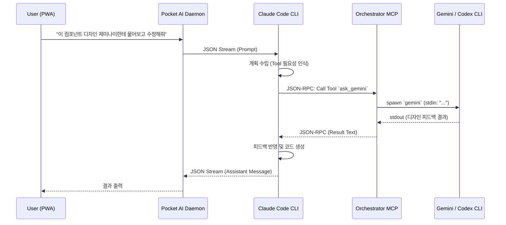

# Multi-Model Orchestration in Pocket AI

Pocket AI 지원하는 "멀티 모델 오케스트레이션(Multi-Model Orchestration)" 기능은 메인 추론 엔진인 **Claude**가 특정 작업(예: 디자인 분석, 코드 적용 등)을 수행할 때 스스로 판단하여 다른 서브 엔진(**Gemini**, **Codex**) 등에게 작업을 위임(Delegate)할 수 있도록 하는 기능입니다.

## Architecture 

이 기능은 **Anthropic의 Model Context Protocol (MCP)** 기술을 기반으로 작동합니다. Pocket AI는 CLI 구동 시 백그라운드에서 동작하는 가상의 로컬 MCP 서버(`orchestrator-server.ts`)를 내장하고 있습니다.

### 핵심 개념

1. **메인 지휘자 (Claude)**:
   - 사용자와 대화하며 목표를 이해하고 계획을 수립합니다.
   - `pocket-ai start claude` 모드로 실행되며, `ClaudeStreamBridge`를 통해 구조화된 JSON 형태로 CLI 데몬과 통신합니다.
2. **로컬 오케스트레이터 (MCP Server)**:
   - `packages/cli/src/mcp/orchestrator-server.ts` 스크립트로 구성된 Node.js 기반 MCP 서버입니다.
   - Claude가 접근할 수 있는 `tools` (예: `ask_gemini`, `ask_codex`)를 제공합니다.
3. **서브 워커 (Gemini / Codex CLI)**:
   - 단순한 Single-shot 태스크를 처리하는 워커 프로세스로, 주어진 프롬프트를 처리하고 텍스트를 응답한 뒤 종료됩니다. (Headless 모드 활용)

### 동작 플로우

## 구현 세부사항

### 1. `orchestrator-server.ts`
- **위치**: `packages/cli/src/mcp/orchestrator-server.ts`
- `@modelcontextprotocol/sdk`를 사용하여 Stdio 방식으로 통신하는 MCP 서버입니다.
- **제공 도구 (Tools)**:
  - `ask_gemini`: 사용자의 프롬프트를 받아 `gemini` CLI를 백그라운드로 스폰(spawn)하여 실행합니다. 긴 컨텍스트 분석 및 일반적인 추론뿐만 아니라 **UI 디자인, 프론트엔드 컴포넌트(React/Web) 생성, 시각적 창의성(UX)** 작업에 고도로 특화되어 있습니다.
  - `ask_codex`: `codex` (Aider) CLI를 스폰하여 실행합니다. 코드 베이스를 직접 수정하거나 파일 상태를 점검하는 데 특화되어 터미널 백엔드 및 레포지토리 컨텍스트 관리에 최적화되어 있습니다.
  
> **💡 설정 및 접근 제어 (Subscriptions)**: 
> 향후 Pocket AI UI/설정에서 사용자가 연동/구독한 도구만 노출시키는 기능이 포함되어 있습니다. (예: `POCKET_AI_ENABLE_GEMINI=true/false`). 구독하지 않은 도구는 아예 노출되지 않거나, 호출 시 "구독/활성화가 필요하다"는 에러를 반환하여 Claude가 맥락을 인지하고 사용자에게 친절하게 안내하게 됩니다.

### 2. 데몬 통합 (`start.ts`)
- `pocket-ai start claude` 명령어 실행 시 `start.ts` 내에서 다음 과정이 자동으로 진행됩니다.
  1. **MCP 프로세스 스폰**: 분리된(detached) 백그라운드 프로세스로 `orchestrator-server.js` 를 실행합니다.
  2. **Claude 설정 등록**: `~/.claude/claude.json` 안의 `mcpServers` 속성을 파싱하여, `pocket-ai-orchestrator`라는 이름으로 MCP 서버 실행 명령 및 인자(args)를 자동 주입합니다.
  3. **Claude 실행**: 설정이 완료된 후 `ClaudeStreamBridge`가 가동되면서, Claude는 즉시 로컬 MCP 툴을 사용할 수 있는 상태로 실행됩니다.

## 실행 예시 (Usage)

Pocket AI 채팅 화면에서 다음과 같이 자연스럽게 Claude에게 요청할 수 있습니다:

> **사용자**: "현재 파일 구조를 분석해서 아키텍처 문서를 작성해줘. 그리고 추가적인 백엔드 코드 생성은 코덱스(ask_codex)에게 지시해서 완료해."

> **사용자**: "내가 디자인한 UI 초안에 대해서 제미나이(ask_gemini)에게 UX 피드백을 받아본 뒤에 코드를 수정해줘."

Claude 모델은 지시받은 내용에 따라 내부적으로 등록된 MCP 서버를 호출하게 되고, 해당 호출 로그 역시 PWA 터미널이나 서버 콘솔에서 확인할 수 있습니다.

## 기존 타 오픈소스와의 비교 (vs `oh-my-claudecode`)

`oh-my-claudecode` 프로젝트 역시 Claude의 다중 에이전트(Multi-Agent) 시스템 구현체로 널리 알려져 있으나, 본 프로젝트의 접근 방식은 다음과 같은 명확한 차별점이 있습니다:

1. **PWA(웹 기반 UI)와의 완벽한 융합**: 
   단순한 터미널 사용 경험에 갇히지 않고, 사용자가 모바일/웹(태블릿 등)에서 PWA를 통해 조작하면 뒷단의 데몬 서버가 백그라운드에서 오케스트레이션을 대신 수행해 줍니다.
2. **경량화 및 커스텀 유연성**:
   사전에 정의된 무겁고 강제된 팀(Team) 파이프라인 대신, 단순한 도구(Tool) 기반의 위임 방식을 채택하여 새로운 도구 추가나 로직 변경에 극도로 유연합니다.
3. **네이티브 MCP 표준 준수**:
   Anthropic의 모델 컨텍스트 프로토콜을 그대로 따르므로 매우 안정적입니다.
   *(단, 사용자의 환경에 이미 `oh-my-claudecode` 기반 MCP가 글로벌(또는 Claude 설정)로 세팅되어 있다면, `claude` 명령어 실행 시 해당 도구들도 함께 노출되므로 충돌 없이 둘 다 사용할 수도 있습니다.)*

## 제한 사항 및 고려점
- **API 사용량**: 메인 모델인 Claude와 병렬로 스폰된 서브 모델(Gemini, GPT-4o 등)의 API 요청이 동시에 발생하므로 할당량과 비용(Token) 관리에 유의해야 합니다.
- **안전성 (계정 정지 방지)**: 
  저희의 MCP 모델 연동 방식은 `OpenHands`나 기타 자동화 에이전트들의 오작동(과도한 무한 루프 에러 등)으로 흔히 발생하는 **API 제공자의 계정 정지(Block) 위험이 사실상 없습니다.** 서브 모델의 호출은 철저히 메인 감독(Claude)가 지시하는 Single-shot 위임 형태로 이루어지며, 표준 CLI 호출을 준수합니다.
- CLI 기반의 Sub-Process 스폰에 의존하므로 사용하는 OS 환경에 따라 백그라운드 프로세스 자원 정리가 확실히 이루어져야 합니다. (현재 데몬 종료 시 시그널을 보내 정리하고 있습니다.)
