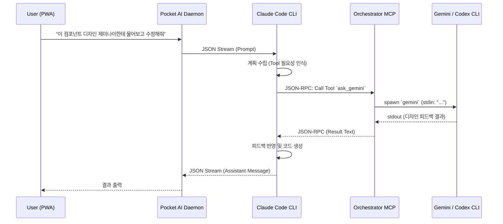

# Multi-Model Orchestration in Pocket AI

Pocket AI 지원하는 "멀티 모델 오케스트레이션(Multi-Model Orchestration)" 기능은 메인 추론 엔진인 **Claude**가 특정 작업(예: 디자인 분석, 코드 적용 등)을 수행할 때 스스로 판단하여 다른 서브 엔진(**Gemini**, **Codex**) 등에게 작업을 위임(Delegate)할 수 있도록 하는 기능입니다.

## Architecture 

이 기능은 **Anthropic의 Model Context Protocol (MCP)** 기술을 기반으로 작동합니다. Pocket AI는 CLI 구동 시 백그라운드에서 동작하는 가상의 로컬 MCP 서버(`orchestrator-server.ts`)를 내장하고 있습니다.

### 핵심 개념

1. **메인 지휘자 (Claude)**:
   - 사용자와 대화하며 목표를 이해하고 계획을 수립합니다.
   - `pocket-ai start claude` 모드로 실행되며, `ClaudeStreamBridge`를 통해 구조화된 JSON 형태로 CLI 데몬과 통신합니다.
2. **로컬 오케스트레이터 (MCP Server)**:
   - `packages/cli/src/mcp/orchestrator-server.ts` 스크립트로 구성된 Node.js 기반 MCP 서버입니다.
   - Claude가 접근할 수 있는 `tools` (예: `ask_gemini`, `ask_codex`)를 제공합니다.
3. **서브 워커 (Gemini / Codex CLI)**:
   - 단순한 Single-shot 태스크를 처리하는 워커 프로세스로, 주어진 프롬프트를 처리하고 텍스트를 응답한 뒤 종료됩니다. (Headless 모드 활용)

### 동작 플로우

## 구현 세부사항

### 1. `orchestrator-server.ts`
- **위치**: `packages/cli/src/mcp/orchestrator-server.ts`
- `@modelcontextprotocol/sdk`를 사용하여 Stdio 방식으로 통신하는 MCP 서버입니다.
- **제공 도구 (Tools)**:
  - `ask_gemini`: 사용자의 프롬프트를 받아 `gemini` CLI를 백그라운드로 스폰(spawn)하여 실행합니다. 긴 컨텍스트 분석 및 일반적인 추론에 적합합니다.
  - `ask_codex`: `codex` (Aider) CLI를 스폰하여 실행합니다. 코드 베이스를 직접 수정하거나 파일 상태를 점검하는 데 특화되어 있습니다.

### 2. 데몬 통합 (`start.ts`)
- `pocket-ai start claude` 명령어 실행 시 `start.ts` 내에서 다음 과정이 자동으로 진행됩니다.
  1. **MCP 프로세스 스폰**: 분리된(detached) 백그라운드 프로세스로 `orchestrator-server.js` 를 실행합니다.
  2. **Claude 설정 등록**: `~/.claude/claude.json` 안의 `mcpServers` 속성을 파싱하여, `pocket-ai-orchestrator`라는 이름으로 MCP 서버 실행 명령 및 인자(args)를 자동 주입합니다.
  3. **Claude 실행**: 설정이 완료된 후 `ClaudeStreamBridge`가 가동되면서, Claude는 즉시 로컬 MCP 툴을 사용할 수 있는 상태로 실행됩니다.

## 실행 예시 (Usage)

Pocket AI 채팅 화면에서 다음과 같이 자연스럽게 Claude에게 요청할 수 있습니다:

> **사용자**: "현재 파일 구조를 분석해서 아키텍처 문서를 작성해줘. 그리고 추가적인 백엔드 코드 생성은 코덱스(ask_codex)에게 지시해서 완료해."

> **사용자**: "내가 디자인한 UI 초안에 대해서 제미나이(ask_gemini)에게 UX 피드백을 받아본 뒤에 코드를 수정해줘."

Claude 모델은 지시받은 내용에 따라 내부적으로 등록된 MCP 서버를 호출하게 되고, 해당 호출 로그 역시 PWA 터미널이나 서버 콘솔에서 확인할 수 있습니다.

## 제한 사항 및 고려점
- **API 사용량**: 메인 모델인 Claude와 병렬로 스폰된 서브 모델(Gemini, GPT-4o 등)의 API 요청이 동시에 발생하므로 할당량과 비용(Token) 관리에 유의해야 합니다.
- **병목 지연(Latency)**: 서브 워커 프로세스가 기동되고 대답을 반환할 때까지 Claude가 블로킹(Blocking) 되므로, 전체 응답 속도가 느려질 수 있습니다.
- CLI 기반의 Sub-Process 스폰에 의존하므로 사용하는 OS 환경(`node-pty` 또는 일반 `spawn`)에 따라 백그라운드 프로세스 자원 정리가 확실히 이루어져야 합니다. (현재 데몬 종료 시 `-mcpProcess.pid` 에 시그널을 보내 정리하고 있습니다.)
