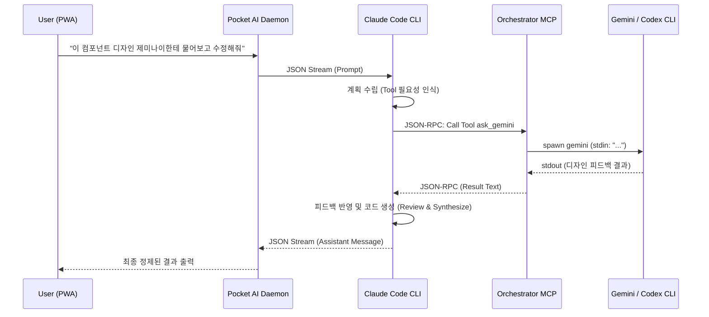

# Multi-Model Orchestration in Pocket AI

Pocket AI가 지원하는 "멀티 모델 오케스트레이션(Multi-Model Orchestration)" 기능은 메인 추론 엔진인 **Claude**가 특정 작업(예: 디자인 분석, 코드 적용 등)을 수행할 때 스스로 판단하여 다른 서브 엔진(**Gemini**, **Codex/Aider**) 등에게 작업을 위임(Delegate)할 수 있도록 하는 기능입니다.

> **⚠️ Pocket AI 전용 기능**: 오케스트레이션은 `pocket-ai start` 실행 중에만 활성화됩니다.
> 종료 시 `~/.claude/claude.json`에서 자동으로 등록 해제되어 일반 `claude` 명령어에서는 동작하지 않습니다.

---

## Architecture

이 기능은 **Anthropic의 Model Context Protocol (MCP)** 기술을 기반으로 작동합니다. Pocket AI는 CLI 구동 시 백그라운드에서 동작하는 로컬 MCP 서버(`orchestrator-server.ts`)를 내장하고 있습니다.

### 핵심 개념

1. **메인 지휘자 (Claude)**:
   - 사용자와 대화하며 목표를 이해하고 계획을 수립합니다.
   - `pocket-ai start claude` 모드로 실행되며, `ClaudeStreamBridge`를 통해 구조화된 JSON 형태로 CLI 데몬과 통신합니다.
2. **로컬 오케스트레이터 (MCP Server)**:
   - `packages/cli/src/mcp/orchestrator-server.ts` 스크립트로 구성된 Node.js 기반 MCP 서버입니다.
   - Claude가 접근할 수 있는 `tools` (예: `ask_gemini`, `ask_codex`)를 제공합니다.
3. **서브 워커 (Gemini / Codex CLI)**:
   - 사용자의 로컬 환경에 미리 설치된 전용 CLI 도구를 자식 프로세스(Sub-process)로 띄워 명령을 실행하고 그 텍스트 결과를 Claude에게 반환하는 단일-샷(Single-shot) 워커입니다.

### 동작 플로우



### 라이프사이클

```
pocket-ai start
  └─ ~/.claude/claude.json에 pocket-ai-orchestrator 등록
  └─ orchestrator-server.js 스폰 (detached)
  └─ ClaudeStreamBridge 시작 (Claude 실행)

pocket-ai 종료 (Ctrl+C / SIGTERM)
  └─ ClaudeStreamBridge.kill()
  └─ ~/.claude/claude.json에서 pocket-ai-orchestrator 삭제  ← PWA 전용 보장
  └─ process.exit(0)
```

---

## 현재 구현 상태 분석

### ✅ 실제로 동작하는 부분

| 컴포넌트 | 상태 | 비고 |
|---|---|---|
| MCP 서버 구조 (`@modelcontextprotocol/sdk`) | ✅ 정상 | Tool 등록/호출 프레임워크 |
| `~/.claude/claude.json` 자동 등록/해제 | ✅ 정상 | start/cleanup 모두 구현됨 |
| 환경변수 기반 워커 토글 | ✅ 정상 | `POCKET_AI_ENABLE_GEMINI/CODEX/AIDER` |
| PWA 빌트인 worker 토글 UI | ✅ 구현됨 | ChatSettingsPanel — Gemini/Codex/Aider ON/OFF |
| 커스텀 worker 등록 (workers.json) | ✅ 구현됨 | `~/.config/pocket-ai/workers.json` |
| PWA 커스텀 worker UI | ✅ 구현됨 | 이름/바이너리/설명 추가 → `ask_<name>` 자동 등록 |
| Tool description (Claude 판단 유도) | ✅ 정상 | 각 워커의 역할이 명확히 정의됨 |
| MCP 프로세스 spawn / cleanup | ✅ 정상 | detached + kill(-pid) |

### ✅ Phase 1에서 수정된 버그 (참고용)

#### 버그 1: `stripAnsi` 정규식 오류

```typescript
// 현재 (broken) — 이중 이스케이프로 ANSI 제거 안 됨
function stripAnsi(input: string): string {
    return input.replace(/\\x1B\\[[0-?]*[ -/]*[@-~]/g, '');
}

// 수정
function stripAnsi(input: string): string {
    return input.replace(/\x1B\[[0-?]*[ -/]*[@-~]/g, '');
}
```

**영향**: 워커의 출력에 ANSI 색상 코드가 그대로 남아 Claude에게 오염된 텍스트가 전달됨.

---

#### 버그 2: tmpFile 생성 후 미사용 (Dead Code)

```typescript
// 현재: 파일을 만들고 쓰지만 spawn에 전혀 사용 안 함
const tmpFile = path.join(os.tmpdir(), `pocket-ai-${engine}-req-${Date.now()}.txt`);
fs.writeFileSync(tmpFile, prompt, 'utf-8');
const child = spawn(engine, [], { ... }); // tmpFile 미전달
```

**영향**: 직접적 버그는 아니나, 원래 `--message-file` 방식으로 설계됐다가 stdin 방식으로 변경하면서 정리가 안 된 잔재. 불필요한 tmp 파일 생성.

---

#### 버그 3: Gemini CLI 호출 방식 오류 → 수정 완료 ✅

```typescript
// 이전 (broken): stdin pipe + 빈 args → interactive REPL에 pipe 연결
const child = spawn('gemini', [], { stdio: ['pipe', 'pipe', 'pipe'] });
child.stdin.write(prompt + '\n');
child.stdin.end();
```

**문제**: Gemini CLI는 기본적으로 대화형 REPL입니다. TTY 없이 stdin pipe만 쓰면 blocking되거나 응답이 오지 않습니다.

**수정**: `-p/--prompt` 헤드리스 플래그 사용. 기존 OAuth 인증을 그대로 재사용합니다.

```typescript
// 수정 후: -p 플래그로 headless 모드 실행, 로컬 OAuth 재사용
const child = spawn('gemini', ['-p', prompt, '--yolo'], {
    cwd: SESSION_CWD,
    stdio: ['ignore', 'pipe', 'pipe'], // stdin 닫음, stdout/stderr만 읽음
    env: { ...process.env },
});
```

`-p/--prompt`: non-interactive(headless) 모드 활성화
`--yolo`: 도구 사용 확인 프롬프트 자동 승인
**API 키 불필요**: 로컬에 저장된 Google OAuth 인증 자동 재사용

---

#### 버그 4: Codex/Aider 바이너리명 혼용 → ✅ 수정됨

**수정**: `ask_aider`와 `ask_codex`를 완전히 별도 툴로 분리 구현.

```typescript
// ask_aider: aider --message ... --yes-always --no-auto-commits --no-pretty
function callAider(prompt): spawn('aider', ['--message', prompt, '--yes-always', '--no-auto-commits', '--no-pretty'])

// ask_codex: codex ... --approval-mode auto-edit --quiet
function callCodex(prompt): spawn('codex', [prompt, '--approval-mode', 'auto-edit', '--quiet'])
```

각 툴은 독립적인 CLI 바이너리, 독립적인 env 토글(`POCKET_AI_ENABLE_AIDER/CODEX`), 독립적인 PWA 토글을 가진다.

---

#### 버그 5: 워커 타임아웃 없음

```typescript
// 현재: 타임아웃 없음 → 워커 hanging 시 Claude 무한 대기
const child = spawn(engine, [], { ... });
child.on('close', () => resolve(output)); // 언제 닫힐지 보장 없음
```

**영향**: 워커가 응답 없이 멈추면 Claude의 tool call이 무한정 blocking됨.

---

#### 버그 6: MCP 프로세스 사전 spawn — Dead Code

```typescript
// start.ts:316-319
// 현재: stdio 전체를 'ignore'로 설정해서 spawn
mcpProcess = spawn(process.execPath, [mcpServerPath], {
    stdio: ['ignore', 'ignore', 'ignore'],  // ← MCP는 stdio로 통신하는데 모두 닫음
    detached: true,
});
mcpProcess.unref();
```

**문제**: MCP Stdio 서버는 stdin/stdout으로 JSON-RPC 통신을 합니다. 그런데 `stdio: ['ignore', 'ignore', 'ignore']`로 모든 통신 채널을 차단하면 이 프로세스는 아무것도 못 합니다.
실제로는 Claude가 `~/.claude/claude.json`에 등록된 command/args를 읽어서 **자기가 직접** MCP 서버를 spawn합니다. 여기서 미리 띄운 프로세스는 아무 역할도 하지 않고 cleanup까지 살아있는 **좀비 프로세스**입니다.

**수정**: 사전 spawn 로직 전체 제거. `~/.claude/claude.json` 등록만으로 충분.

---

#### 버그 7: `claude.json` 파일 비원자 쓰기 (Race Condition)

```typescript
// start.ts (등록 시)
const config = JSON.parse(fs.readFileSync(claudeConfigPath, 'utf-8')); // read
config.mcpServers['pocket-ai-orchestrator'] = { ... };
fs.writeFileSync(claudeConfigPath, JSON.stringify(config, null, 2));   // write (비원자)

// cleanup 시 동일 패턴
```

**문제**: read → modify → write 사이에 다른 프로세스(다른 claude 인스턴스, IDE 플러그인 등)가 `claude.json`을 수정하면 해당 변경 내용이 덮어써집니다.

**수정**: 원자적 파일 쓰기:
```typescript
const tmpPath = claudeConfigPath + '.tmp';
fs.writeFileSync(tmpPath, JSON.stringify(config, null, 2));
fs.renameSync(tmpPath, claudeConfigPath); // 원자적 교체
```

---

#### 버그 8: 워커에 `cwd` 미전달

```typescript
// 현재: cwd 지정 없음 → 워커가 엉뚱한 디렉토리에서 실행
const child = spawn(engine, [], {
    stdio: ['pipe', 'pipe', 'pipe'],
    env: { ...process.env }
    // cwd 없음!
});
```

**영향**: 코드 편집 작업(Codex/Aider)에서 프로젝트 파일을 찾지 못함.

---

## 개선안 (Implementation Proposals)

### 개선안 1: Gemini — REST API 직접 호출로 교체

CLI 의존 없이 안정적인 단일샷 호출:

```typescript
async function callGemini(prompt: string): Promise<string> {
    const apiKey = process.env.GEMINI_API_KEY;
    if (!apiKey) throw new Error('GEMINI_API_KEY 환경변수 필요');

    const res = await fetch(
        `https://generativelanguage.googleapis.com/v1beta/models/gemini-2.0-flash:generateContent?key=${apiKey}`,
        {
            method: 'POST',
            headers: { 'Content-Type': 'application/json' },
            body: JSON.stringify({ contents: [{ parts: [{ text: prompt }] }] }),
            signal: AbortSignal.timeout(60_000),
        }
    );
    const data = await res.json() as any;
    if (!res.ok) throw new Error(data.error?.message ?? 'Gemini API 오류');
    return data.candidates[0].content.parts[0].text as string;
}
```

**장점**: CLI 설치 불필요, 안정적, TTY 문제 없음
**전제**: `GEMINI_API_KEY` 필요 (또는 기존 `gcloud` 인증 재활용)

---

### 개선안 2: Aider — 올바른 플래그로 교체

```typescript
async function callAider(prompt: string, cwd: string): Promise<string> {
    return new Promise((resolve, reject) => {
        const child = spawn('aider', [
            '--message', prompt,
            '--yes-always',         // 확인 프롬프트 자동 승인
            '--no-auto-commits',    // Git 자동 커밋 방지
            '--no-pretty',          // 색상/포맷 출력 비활성화
        ], {
            cwd,                    // 프로젝트 디렉토리 전달
            stdio: ['pipe', 'pipe', 'pipe'],
            env: { ...process.env },
        });

        const timer = setTimeout(() => { child.kill(); reject(new Error('aider timeout')); }, 120_000);
        let output = '';
        child.stdout.on('data', d => output += d);
        child.stderr.on('data', d => output += d); // aider는 stderr에도 유용한 출력 있음
        child.on('close', () => { clearTimeout(timer); resolve(stripAnsi(output)); });
        child.on('error', err => { clearTimeout(timer); reject(err); });
    });
}
```

---

### 개선안 3: 공통 타임아웃 + stripAnsi 수정

```typescript
function stripAnsi(input: string): string {
    // 수정: \\x1B → \x1B
    return input.replace(/\x1B\[[0-?]*[ -/]*[@-~]/g, '');
}

function withTimeout<T>(promise: Promise<T>, ms: number, label: string): Promise<T> {
    const timer = new Promise<never>((_, reject) =>
        setTimeout(() => reject(new Error(`${label} timeout after ${ms}ms`)), ms)
    );
    return Promise.race([promise, timer]);
}

// 사용
const result = await withTimeout(callGemini(prompt), 60_000, 'gemini');
```

---

### 개선안 4: 커스텀 워커 등록 시스템 ✅ 구현 완료 (Phase 2)

`~/.config/pocket-ai/workers.json` 으로 사용자 정의 워커 관리. PWA 설정 UI에서 추가/삭제 가능.

**실제 구현된 형식** (CLI 바이너리 기반, 심플):

```json
[
  { "name": "goose", "binary": "goose run", "description": "Block AI for data pipelines" },
  { "name": "perplexity", "binary": "perplexity ask", "description": "Real-time web search" }
]
```

MCP 서버는 `ListToolsRequestSchema` 호출 시마다 workers.json을 실시간 재로드 → **재시작 없이 즉시 반영**:

```typescript
function loadCustomWorkers(): CustomWorker[] { /* workers.json 읽어 유효성 검사 후 반환 */ }

server.setRequestHandler(ListToolsRequestSchema, async () => {
    // 빌트인 툴 + 커스텀 워커 동적 등록
    for (const worker of loadCustomWorkers()) {
        tools.push({ name: `ask_${worker.name}`, description: worker.description, ... });
    }
});
```

---

### 개선안 5: 워커 진행 상태 실시간 표시

현재는 워커 실행 중 PWA에 아무것도 표시되지 않음. `session-event`로 상태 중계:

```typescript
// start.ts에서 MCP tool_use 이벤트를 감지하여 PWA에 중계
// Claude가 ask_gemini를 호출하면 → PWA에 "Gemini 분석 중..." 표시
```

---

### 개선안 6: PWA 설정 패널 ✅ 구현 완료 (Phase 2)

`ChatSettingsPanel.tsx`에 Orchestration Workers 섹션 구현 완료:

```
Session Settings > Orchestration Workers
  Built-in
  [✓] ask_gemini  [Google]  Google Gemini CLI — 광범위한 지식, UI 디자인
  [✓] ask_codex   [OpenAI]  OpenAI Codex CLI — 복잡한 리팩토링, GPT 기반 코드 생성
  [✓] ask_aider   [Aider]   Aider CLI — git-native 코드 편집, 100+ 모델

  ── Custom ──
  [ask_goose]  goose run  "데이터 파이프라인..."  [삭제]
  [+ Worker 추가]
```

토글 변경 시 `set-builtin-workers` 제어 명령어로 `~/.claude/claude.json` MCP env 즉시 업데이트.
커스텀 worker 추가/삭제 시 `set-workers` 명령어로 `~/.config/pocket-ai/workers.json` 즉시 업데이트.

---

## 토큰 경제성 실제 평가

### 이론적 근거 (유효)

LLM API 요금 체계상 output 토큰이 input 토큰보다 3~5배 비쌉니다. 긴 코드를 Claude 대신 더 저렴한 모델(또는 로컬 구독 한도 내의 Gemini)에게 생성시키는 것은 경제적으로 유효한 전략입니다.

### 현실적 제약

- **Latency 추가**: CLI 스폰 기동 시간 (~2~5초) + 응답 대기 시간
- **API 비용 이중 발생**: Claude (input) + Gemini API (output) — 무조건 저렴하지 않음
- **Gemini 무료 할당량 활용 시**: 가장 경제적 (무료 tier 내에서 처리)

### 권장 사용 패턴

| 작업 유형 | 권장 | 이유 |
|---|---|---|
| 단순 변수명 변경, 짧은 수정 | Claude 직접 | 워커 overhead가 더 큼 |
| React 컴포넌트 전체 생성 | Gemini 위임 | output 토큰 절감 |
| 다중 파일 리팩토링 | Aider 위임 | 파일 컨텍스트 + 편집 특화 |
| 문서 생성, 긴 분석 | Gemini 위임 | 긴 context window 활용 |

---

## 안전성 설계

### ToS 위반 완전 방지

- **No Session Hijacking**: 웹 세션 쿠키 탈취 없음. 공식 API Key / CLI OAuth 활용
- **Single-Shot 위임**: 워커는 1회 호출 후 종료 — 무한 루프 불가
- **MCP 표준 준수**: Anthropic 공식 스펙 100% 준수
- **PWA 전용 활성화**: 일반 `claude` 실행 시 비활성화 (cleanup 메커니즘)

---

## 제한 사항

- **로컬 CLI 의존**: Aider/Gemini CLI가 사전 설치 + 인증 필요
- **Latency**: 워커 기동 2~10초 추가
- **병렬 실행 미지원**: 현재 Claude가 순차적으로 tool 호출 — 동시 실행 불가
- **cwd 공유 없음**: 워커와 Claude의 파일 컨텍스트 분리 (개선안 2로 해결 가능)

---

## TODO / 우선순위 로드맵

### Phase 1 — 버그 수정 ✅ 완료

- [x] `stripAnsi` 정규식 수정 (`\\x1B` → `\x1B`)
- [x] tmpFile dead code 제거
- [x] Gemini `-p/--prompt` 헤드리스 모드로 수정 (로컬 OAuth 재사용, API 키 불필요)
- [x] Aider 바이너리/플래그 수정 (`aider --message ... --yes-always --no-pretty`)
- [x] 워커 타임아웃 추가 (Gemini 60s, Aider 120s)
- [x] 워커에 `cwd` 전달 (`POCKET_AI_CWD` env via MCP 등록)
- [x] MCP 좀비 프로세스 spawn dead code 제거 (start.ts)
- [x] `claude.json` 원자적 쓰기 (tmpPath + renameSync)

### Phase 2 — 핵심 개선 ✅ 완료

- [x] PWA 설정 패널: 빌트인 worker (Gemini/Codex/Aider) 토글 UI ✅
- [x] PWA 설정 패널: 커스텀 worker 등록/삭제 UI ✅
- [x] ask_aider + ask_codex 독립 툴로 분리 구현 ✅
- [x] workers.json 기반 커스텀 worker 영속화 + 실시간 반영 ✅
- [x] 워커 실행 중 PWA 진행 상태 표시 (OrchestratorWorkerCard: 경과시간, Aider diff) ✅
- [x] PWA 재연결 시 로컬 이력 복원 (CLI JSONL → history-start/end 프로토콜) ✅
- [ ] Gemini REST API 직접 호출 구현 (CLI 의존 제거)

### Phase 3 — 확장 (중기)

- [ ] REST API 워커 타입 지원 (OpenAI 호환, Perplexity, Ollama)
- [ ] 동적 슬래시 명령어 연동 (PWA 자동완성)
- [ ] 워커 병렬 실행 (ask_gemini + ask_aider 동시)
- [ ] 워커 결과 승인 플로우 (모바일에서 Aider 변경사항 확인/거부)
- [ ] pocket-ai doctor 명령어 (worker 사전 설치 검증)
